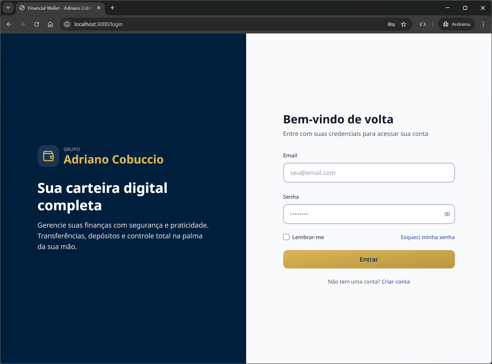
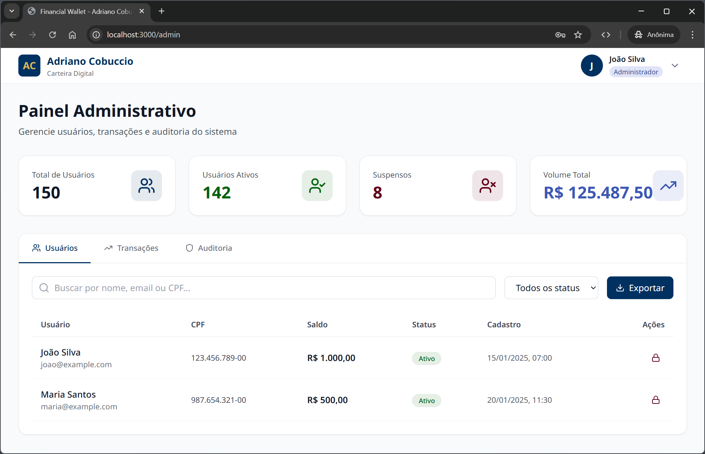

# Financial Wallet MVP 💰

[](https://laravel.com)
[](https://php.net)
[](https://postgresql.org)
[](https://react.dev)
[](backend/tests)
[](backend/tests)
[](https://github.com/NeuronioAzul/financial-wallet/releases)

## Métricas do Sistema


Digital wallet system with complete transaction management, LGPD compliance, and professional design system.

## Login Page



## Admin

### Dashboard



### Painel


## 🚀 Tech Stack

**Backend**

- PHP 8.4-FPM + Laravel 12 + Sanctum authentication
- PostgreSQL 18 with UUID v7
- Pest 3 testing framework

**Frontend**

- React 18 + TypeScript 5.5
- Vite 5.3 + TailwindCSS 3.4
- React Router v6 + React Hook Form + Zod

**Infrastructure**

- Docker + Docker Compose orchestration
- Swagger UI for API documentation

## ✨ Features

### Backend (23 RESTful Endpoints)

- ✅ User authentication with Laravel Sanctum
- ✅ Role-based access control (Admin & Customer)
- ✅ Real-time balance validation with concurrency control
- ✅ Transaction management (deposits, transfers, reversals)
- ✅ User profile and address management
- ✅ Document management (CPF, RG, CNH, passport)
- ✅ Admin dashboard with user management
- ✅ Complete LGPD compliance and audit trail
- ✅ Rate limiting (60 req/min)
- ✅ UUID v7 for all entities

### Frontend

- ✅ Authentication pages (login, register, password recovery)
- ✅ Dashboard with financial summary
- ✅ Admin panel for user management
- ✅ Transaction history with filters and pagination
- ✅ User profile management
- ✅ Deposit and transfer modals
- ✅ Legal pages (Terms & Privacy)
- ✅ Ocean Blue design system
- ✅ Form validation with Zod
- ✅ Responsive layout

## 📁 Project Structure

```text
financial-wallet/
├── .docker/              # Docker configurations
├── .github/              # GitHub workflows and conventions
├── backend/              # Laravel 12 API
│   ├── app/
│   │   ├── Http/Controllers/Api/
│   │   ├── Models/
│   │   ├── Services/
│   │   └── Enums/
│   ├── database/migrations/
│   ├── routes/api.php
│   └── tests/
├── frontend/             # React 18 SPA
│   └── src/
│       ├── components/
│       ├── pages/
│       ├── services/
│       └── contexts/
├── docs/                 # Documentation
├── scripts/              # Automation scripts
├── swagger/              # OpenAPI specifications
└── docker-compose.yml
```

## ⚡ Quick Start

```bash
# Clone the repository
git clone https://github.com/NeuronioAzul/financial-wallet.git
cd financial-wallet

# Configure environment
cp .env.example .env

# Start development environment
./scripts/inicia-ambiente-dev.sh
```

**Access Points:**

- Backend API: <http://localhost:8000>
- Frontend: <http://localhost:3000>
- Swagger UI: <http://localhost:8080>
- PostgreSQL: localhost:5432

**Test Credentials:**

- Email: `joao@example.com` | Password: `password` (Balance: R$ 1,000.00)
- Email: `maria@example.com` | Password: `password` (Balance: R$ 500.00)

## 🧪 Testing


Run the PHPUnit backend tests with:

```bash
# Run backend tests
docker compose exec backend php artisan test
```

Or run all tests using the provided shell script:

```bash
# Or use the test script
./scripts/test.sh
```

## 📋 Git Commit Convention

This project follows the Airbnb commit convention:

```bash
type(scope): subject
```

**Examples:**

- `feat(auth): add jwt authentication`
- `fix(wallet): correct balance calculation`
- `docs: update api documentation`

A git hook automatically validates all commits. See [Commit Convention](.github/COMMIT_CONVENTION.md) for details.

## 📚 Documentation

- [Documentation Overview](./docs/documentation-overview.md) - Complete documentation guide
- [Setup Guide](./docs/setup-guide.md) - Complete development environment setup
- [Backend Documentation](./backend/README.md) - Laravel API documentation
- [Frontend Documentation](./frontend/README.md) - React application documentation
- [Database Schema](./docs/architecture/database-schema.md) - PostgreSQL schema and design
- [Design System](./docs/design-system.md) - Color palette and UI components
- [API Reference](./docs/api-reference.md) - Complete REST API documentation
- [API Documentation](http://localhost:8080) - Swagger UI (when running)
- [Commit Convention](.github/COMMIT_CONVENTION.md) - Git commit standards

## 🔒 Security

- Laravel Sanctum for authentication (Bearer tokens)
- BCrypt password hashing
- Input validation on all requests
- Rate limiting (60 requests/minute)
- CORS configuration
- CSRF protection
- UUID v7 for non-sequential IDs
- Row locking for transaction safety

## 🐳 Docker Services

| Service | Container | Port | Description |
|---------|-----------|------|-------------|
| Backend | financial-wallet-backend | 8000 | Laravel 12 API + PHP 8.4 |
| Frontend | financial-wallet-frontend | 3000 | React 18 + Vite |
| PostgreSQL | financial-wallet-db | 5432 | PostgreSQL 18 |
| Swagger | financial-wallet-swagger | 8080 | API Documentation |

## 📊 Project Status

- **Backend:** ✅ MVP Complete (23 endpoints)
- **Frontend:** ✅ MVP Complete (6 pages)
- **Database:** ✅ Schema with LGPD compliance
- **Tests:** ✅ Backend tested with Pest
- **Docker:** ✅ Full containerized environment
- **API Docs:** ✅ Swagger documentation

## 🛠️ Useful Commands

```bash
# Start complete environment
./scripts/inicia-ambiente-dev.sh

# Run backend tests
./scripts/test.sh

# View logs
docker compose logs -f [backend|frontend|postgres]

# Access containers
docker compose exec backend bash
docker compose exec frontend sh

# Stop environment
docker compose down

# Remove volumes (⚠️ deletes data)
docker compose down -v
```

## 🚀 Roadmap

- [ ] Real-time notifications (WebSockets)
- [ ] Multi-currency support
- [ ] Two-factor authentication (2FA)
- [ ] Administrative dashboard
- [ ] Reports and data export
- [ ] Frontend E2E tests
- [ ] CI/CD pipeline
- [ ] Production deployment

## 👥 Contributing

1. Fork the project
2. Create a feature branch (`git checkout -b feat/new-feature`)
3. Commit using the Airbnb convention
4. Push to the branch (`git push origin feat/new-feature`)
5. Open a Pull Request

## 👨🏻‍💻 Author

> **Mauro Rocha Tavares**

- Email: <mauro.rocha.t@gmail.com>
- GitHub: [@NeuronioAzul](https://github.com/NeuronioAzul)

## 📄 License

This project is licensed under the MIT License.
